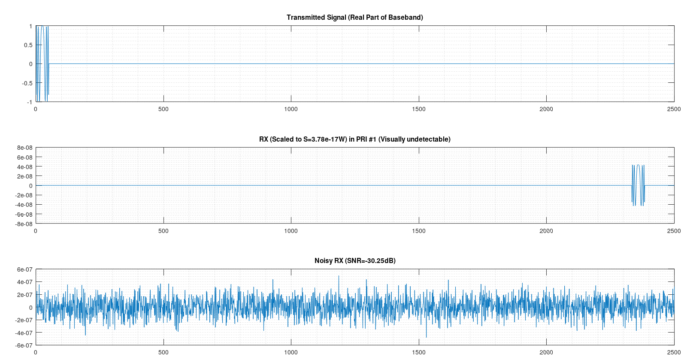
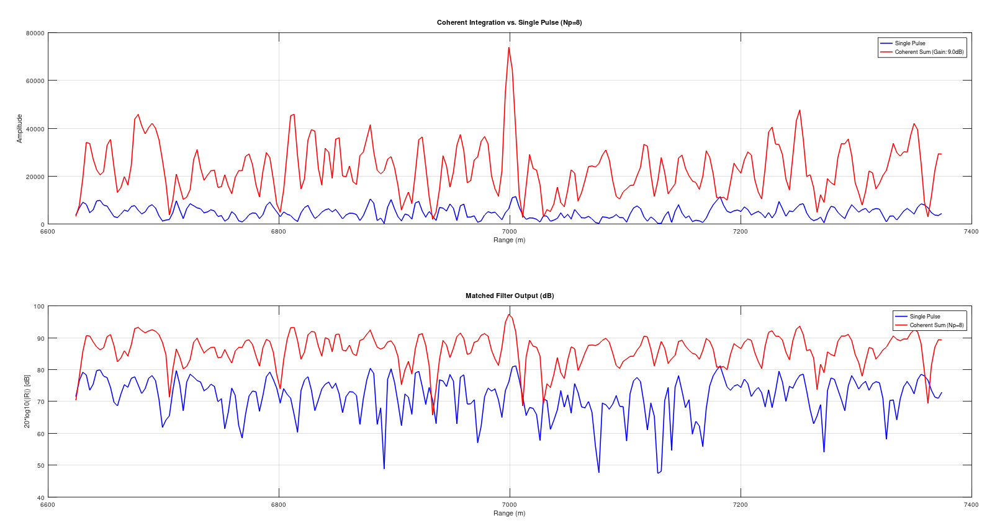
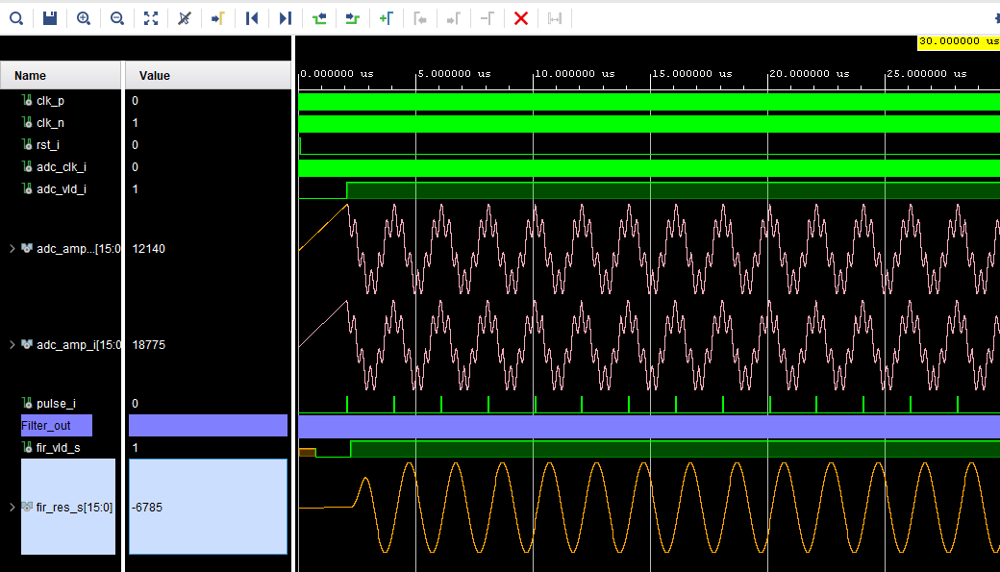
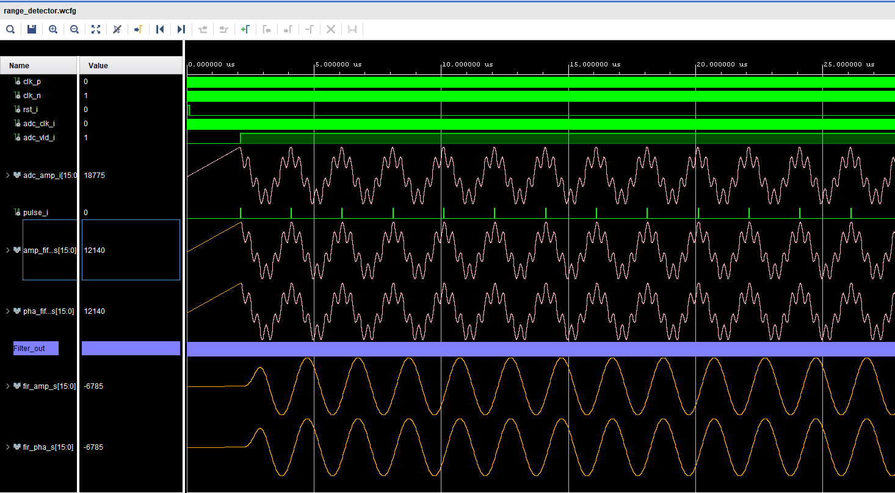
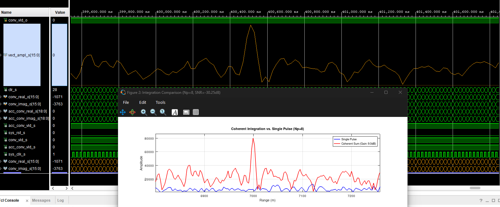
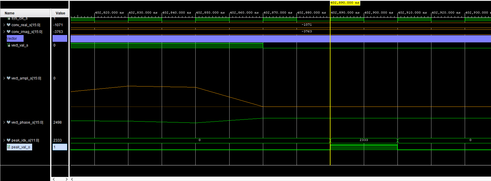

# Radar Correlation & DSP Suite

This repository implements a high-precision, hardware-efficient Radar processing chain in standard VHDL. It features a bit-true workflow validating DSP48E1 hardware implementations against Octave/MATLAB golden reference models.

The primary engine is a **Quad-Channel Complex Matched Filter & Coherent Integrator** utilizing four parallel 5x time-division folded 50-tap symmetric FIR architectures followed by a dual Block RAM range-bin coherent accumulator and CORDIC vectoring engine. Running at 250 MHz on budget Zynq-7000 silicon, the complete quad-channel filtering stage requires **20 DSP48E1 slices** while maintaining full timing closure.

---

## Repository Structure

```text
Correlation/
├── constraints/                  # Timing and physical placement constraints
│   └── range_detector.xdc        # 250 MHz clock definition and CDC path constraints
├── docs/                         # Hardware verification snapshots and documentation
│   ├── Firt_matched_filter.png   # Single-channel matched filter waveform snapshot
│   ├── IQ_match_filter.png       # Dual-channel (I/Q) matched filter waveform snapshot
│   ├── tx_noisy_rx_pulses.png    # Octave simulation: Transmitted and noisy RX pulses
│   ├── detected_range.png        # Octave simulation: Coherent integration range detection
│   ├── max_peak.png              # Alignment verification between hardware CORDIC magnitude & Octave peak
│   └── module_final_output.png   # Peak detector hardware latching index 2333 on falling edge of valid
├── ipcores/                      # AMD/Xilinx IP core definitions
│   ├── adc_fifo/                 # Dual-clock asynchronous CDC FIFO
│   ├── clk_dsp/                  # Clocking Wizard generating 250 MHz DSP clock
│   └── IQ2vector/                # CORDIC phase extraction IP core
├── m_files/                      # Octave/MATLAB scripts for bit-true golden models
│   ├── Correlation_3.m           # System-level correlation, matched filter & coherent sum model
│   ├── golden_ref_vector.dat     # Exported golden reference test data
│   ├── my_comp_round.m           # Complex rounding helper model
│   ├── myconv.m                  # Bit-true fixed-point convolution algorithm
│   └── myround.m                 # Golden reference for convergent (round-to-even) rounding
├── rtl_sim/                      # Testbenches and simulation assets
│   ├── IQ2Vect_tb.vhd            # Vectoring module testbench
│   ├── range_detector.wcfg       # Vivado XSIM waveform configuration
│   ├── rtl_golden_ref_vector.vhd # Golden reference test vectors
│   ├── tb_range_detector.vhd     # Top-level range detector testbench
│   └── test_fix_round.vhd        # Fixed-point rounding testbench
├── rtl_src/                      # Synthesizable RTL source files
│   ├── coherent_sum.vhd          # Dual BRAM coherent range-bin pulse accumulator
│   ├── complex_convolution.vhd   # Top-level complex convolution integrating 4 I/Q FIRs and rounding
│   ├── conv_rounding.vhd         # Convergent rounding (round-to-even) logic
│   ├── DSP_wrapper.vhd           # Parametric DSP48E1 macro wrapper
│   ├── fir_impl.vhd              # 50-tap symmetric folded FIR filter engine
│   ├── radar_pkg.vhd             # Design constants, types, and FIR coefficients
│   ├── range_detector.vhd        # Dual-channel CDC wrapper and top-level processing
│   └── vectoring.vhd             # CORDIC magnitude and phase processing interface
├── scripts/                      # Project build automation
│   ├── range_detector.tcl        # Vivado Project Mode generation script
│   └── runme.bat                 # One-click Windows batch installer
├── .gitignore                    # Standard Git exclusions for Vivado build artifacts
├── LICENSE                       # Project licensing terms
└── README.md                     # Repository documentation
```

---

## MATLAB / Octave System Modeling (`m_files`)

The `m_files/` directory contains system-level scripts used to design, quantize, and verify the VHDL RTL implementation:

1. **System Correlation & Coherent Accumulation Model (`Correlation_3.m`):** Top-level simulation modeling pulse compression, complex matrix matched filtering, and inter-pulse coherent integration.
2. **Convolution & Fixed-Point DSP (`myconv.m`):** Custom convolution routine modeling fixed-point arithmetic before RTL migration.
3. **Bit-True Rounding Models (`myround.m` & `my_comp_round.m`):** Implements convergent rounding (round-to-even) and complex rounding models to eliminate DC bias during bit-width reduction.
4. **Hardware Streaming Alignment:** To perfectly emulate the continuous pipelined nature of the hardware, the software flattens the multi-pulse noisy RX matrix into a serialized 1D array. It injects a 50-sample blanking window (zeros) at the start of each Pulse Repetition Interval (PRI) to emulate physical radar receiver muting during the transmit window, successfully flushing the filter tails. 





5. **Golden Vector Dataset (`golden_ref_vector.dat`):** Exported test vector dataset used to populate `rtl_sim/rtl_golden_ref_vector.vhd` for self-checking VHDL simulation.

---

## Hardware Architecture & Verification

### 1. Quad-Channel Complex Matched Filter
To achieve true complex cross-convolution $(I_{rx} + jQ_{rx}) * (I_{tx} - jQ_{tx}) = (I_{rx}I_{tx} + Q_{rx}Q_{tx}) + j(Q_{rx}I_{tx} - I_{rx}Q_{tx})$, four distinct FIR instances are utilized:
* **4 Parallel Processing Engines:** Four 50-tap symmetric FIR filter instances process $I_{rx} \cdot I_{tx}$, $Q_{rx} \cdot Q_{tx}$, $Q_{rx} \cdot I_{tx}$, and $I_{rx} \cdot Q_{tx}$ in parallel.
* **5x Time-Division Folding:** Each FIR engine folds 50 taps down to 5 cascaded DSP48E1 slices operating at 250 MHz (5 clock cycles per input sample).
* **Resource Consumption:** Consumes 20 DSP48E1 slices (~9% of Zynq-7000 DSP resources) for complete complex I/Q filtering while achieving zero timing violations.
* **Clock Domain Crossing (CDC):** Dual ADC channels cross safely into the 250 MHz DSP clock domain via an asynchronous FIFO (`adc_fifo`).





### 2. Complex Convolution & Bit-True Streaming Verification
The `complex_convolution.vhd` module encapsulates the four folded FIRs along with custom convergent rounding logic. The RTL has been rigorously validated against the Octave models:
* **RX Blanking Synchronization:** The RTL automatically enforces a 50-cycle input suppression (zeros) at the start of each PRI to emulate TX-to-RX isolation, identically matching the serialized algorithm in Octave.
* **Full-Resolution vs. Rounded Output:** The system preserves full 32-bit internal precision during integration before seamlessly slicing down to a 16-bit output. Both the raw 32-bit streaming output and the convergent rounded 16-bit payload are validated cycle-by-cycle against Octave references, verifying that zero DC-bias is introduced.

### 3. Coherent Inter-Pulse Summation (`coherent_sum.vhd`)
Following complex convolution, pulse-to-pulse coherent integration is performed across multiple PRIs to maximize SNR gain:
* **Dual Block RAM Architecture:** Implements a dual-port RAM pipeline (`acc_ram_s`) storing range-bin I and Q accumulation values across consecutive PRIs.
* **Pulse Repetition Interval (PRI) Boundary Tracking:** Uses the falling edge of the input valid window to reset range-bin pointers and increment pulse counters up to the target pulse count ($N_{pulses} = 8$).
* **Precision Expansion:** Integrates 16-bit rounded complex samples into 19-bit accumulator bins to prevent overflow during multi-pulse summation.
* **Bit-True Verification:** Output validated cycle-by-cycle against the Octave matrix integration reference.

### 4. CORDIC Polar Conversion & Peak Detection Verification

The 19-bit full-resolution Cartesian accumulator outputs feed into the CORDIC vectoring module to derive magnitude and phase:

* **CORDIC Vectoring:** Converts 19-bit accumulated I/Q pairs into magnitude and phase outputs. The output amplitude is truncated to a 16-bit representation (`vect_ampl_s`).
* **Bit-Slicing & Truncation Ratio Analysis:** The ratio between Octave's unscaled floating-point magnitude ($\text{Max} = 131799$) and the hardware CORDIC 16-bit truncated output ($\text{Max} = 10005$) precisely reflects the CORDIC processing gain ($A_v \approx 1.64676$), the 8-pulse coherent gain ($8\times$), and the pipeline fixed-point truncation scale factor.



* **End-to-End Peak Index Latching:** As shown in the simulation trace below, the hardware peak detector tracks streaming samples and latches `peak_idx_o = 2333` on the falling edge of `vect_val_s`, achieving exact parity with Octave range estimation ($R = 6999\text{ m}$).



---

## Build Instructions

To generate the complete Vivado project environment using the automated project mode script:

1. Open a command prompt inside `scripts/`.
2. Run the batch launcher:

```cmd
runme.bat
```

The script automatically:
* Sources the Xilinx Vivado environment via `settings64.bat`.
* Imports IP cores (`adc_fifo.xci`, `clk_dsp.xci`).
* Adds targeted RTL sources (including `coherent_sum.vhd`) from `rtl_src/` and simulation assets from `rtl_sim/`.
* Sets `range_detector` as the top-level entity and `tb_range_detector` as the simulation top.
* Applies constraints from `constraints/range_detector.xdc`.